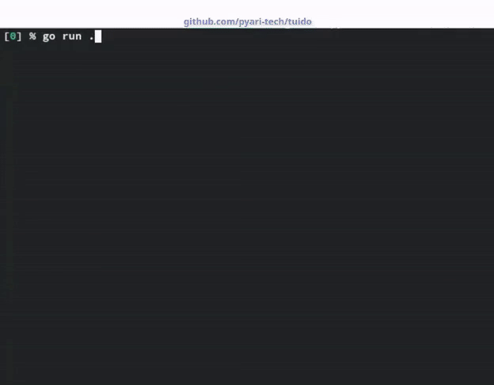

## tuido

Is a ToDo in a TUI.

> trying to make it with [_Charm_'s Bubbletea](https://github.com/charmbracelet/bubbles)

### HowTo Use

**On Task Board**

* `+` or `n`: Add new task to **ToDo** list

* `-` or `[DELETE]`: Delete selected Task

* `u` or `[INSERT]`: Update selected Task's Title or Description

* `r` or `TAB`: Display Task Details; as longer text gets hidden in list

* `right/left arrow key`: Move across Lists

* `[` or `w`: Move selected Task UP in the same list

* `<` or `a`: Move selected Task to Previous List

* `]` or `s`: Move selected Task DOWN in the same list

* `>` or `d`: Move selected Task to Next List

**On Task/Item Form**

* `[ENTER]`: When in `Title` input field, moves to `Description` field. When in `Description` field, adds/updates to Task Board.

* `Ctrl + k`: Skips adding new Task

> Loads/Saves state from/to `tuido.yaml` by default. Can pick custom filepath with `-file <yaml-filepath>` flag.

---
